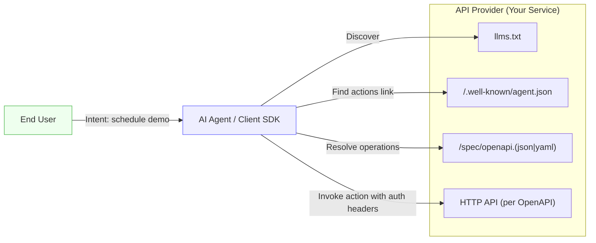
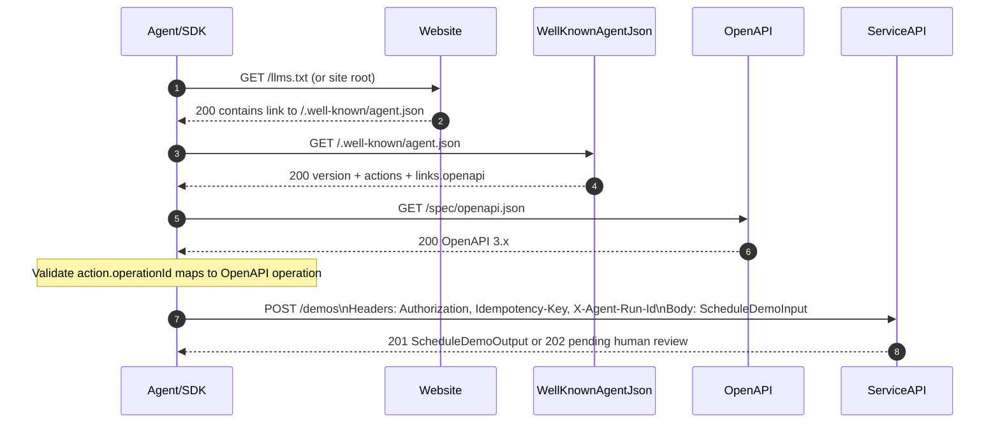
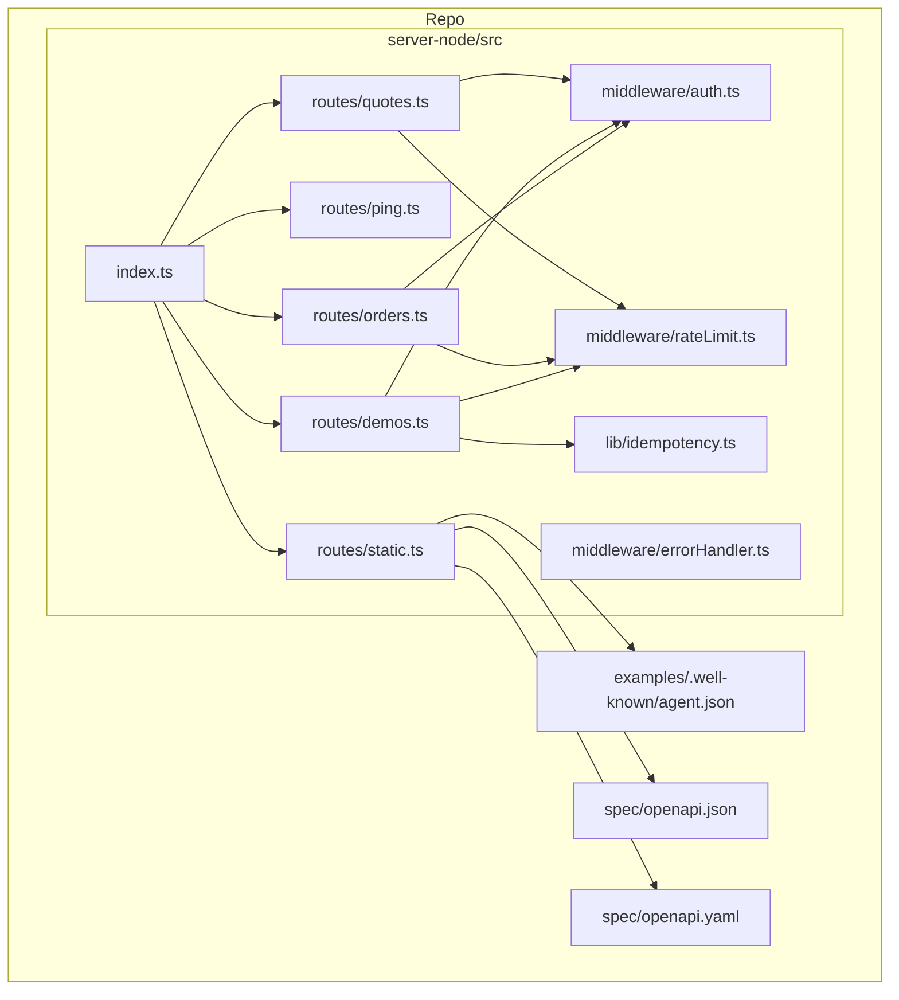
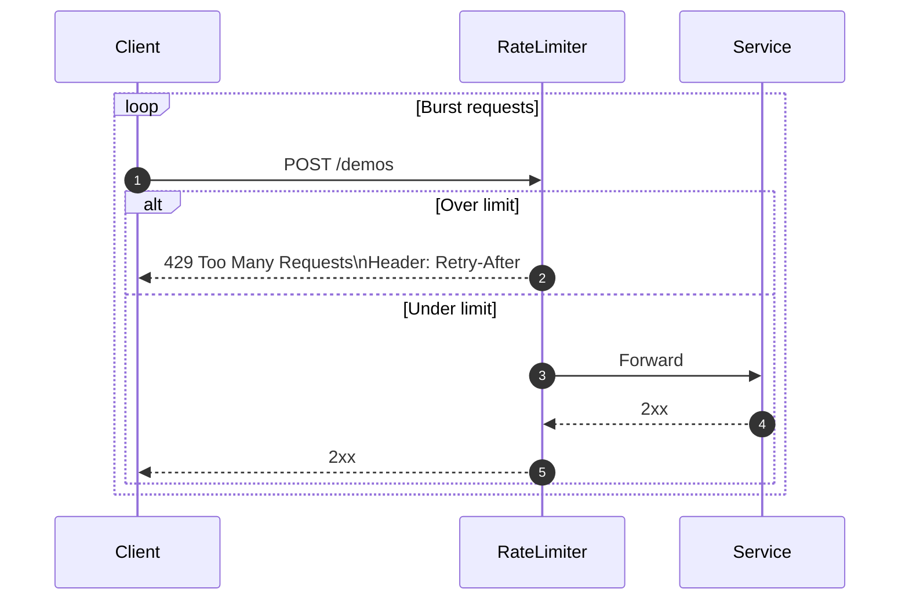
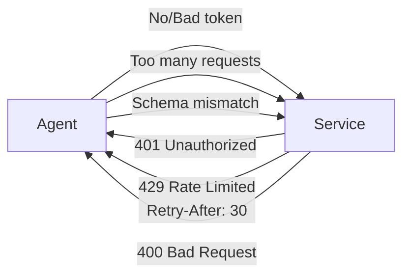
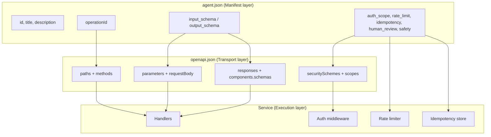
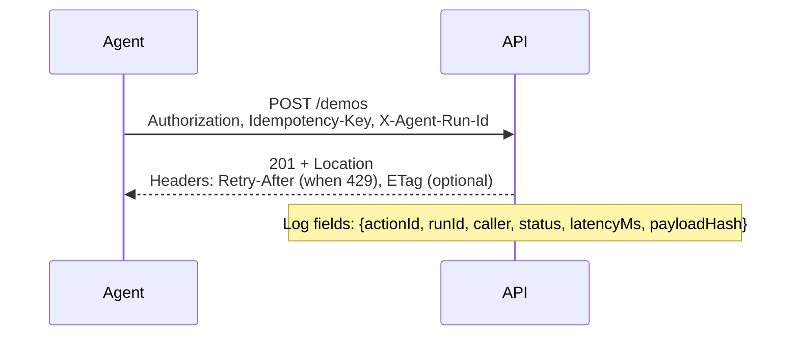
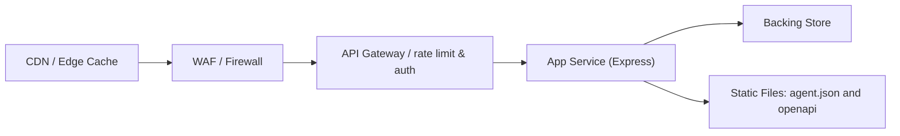
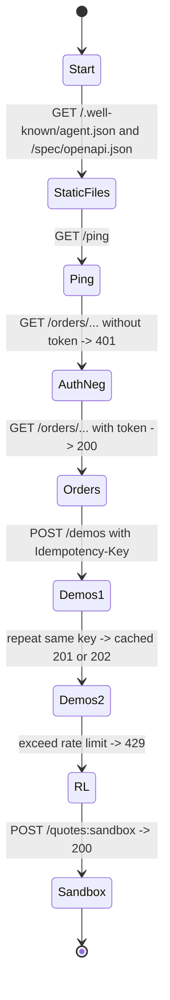

# Action.txt — Architecture & Data Flows

This document explains how **Action.txt** fits into your stack, how agents discover and call capabilities, and how producers/consumers should handle auth, idempotency, and rate limits.

> Diagrams use Mermaid, which renders natively on GitHub. You can later export to SVG/PNG if needed.

---

## 1) High-Level System Overview



**Key roles**

* `llms.txt` → tells agents *where* actions live.
* `/.well-known/agent.json` → lists *what* actions exist (ids, schemas, safety).
* `openapi.(json|yaml)` → defines *how* to call them (paths, methods, headers).
* API → implements behavior with auth, rate limits, and idempotency.

---

## 2) Discovery & Invocation (Happy Path)



**Performance notes**

* Cache `agent.json` and OpenAPI (`ETag`, `max-age ~5m`).
* Pre-validate payloads client-side against `input_schema`.

---

## 3) Minimal Integration Architecture (Node/TS)



**Responsibilities**

* `routes/*` match OpenAPI operations.
* `auth.ts` enforces Bearer token (JWT optional).
* `rateLimit.ts` sets per-action buckets + `Retry-After`.
* `idempotency.ts` caches POST `/demos` responses by `Idempotency-Key`.
* `errorHandler.ts` returns `{code,message,details?}` per `Error` schema.

---

## 4) Idempotency & Rate Limit Semantics

```mermaid
sequenceDiagram
  autonumber
  participant C as Client
  participant M as Middleware
  participant S as Service

  C->>M: POST /demos (Idempotency-Key: K, Body: B)
  M->>M: Compute hash H(B); lookup K
  alt Cache hit and same hash
    M-->>C: 201/202 cached response
  else No cache entry
    M->>S: Forward request
    S-->>M: 201/202 response
    M->>M: Store {K, H, response}
    M-->>C: 201/202 response
  end
```

Rate limiting



**Rules**

* **Idempotency-Key** is **required** on non-idempotent POSTs.
* Cache lifetime = `IDEMP_TTL_SECONDS`.
* If **same key, different payload hash** → **recommend 409 Conflict** (or treat as independent; document behavior).

---

## 5) Error Model & Negative Paths



**Error payload (canonical):**

```json
{
  "code": "string",
  "message": "human-readable",
  "details": { "context": "optional object" }
}
```

**OpenAPI alignment**

* Reuse `components.schemas.Error` in all named responses (`Unauthorized`, `RateLimited`, etc.).

---

## 6) Data Contracts: Manifest ↔ OpenAPI ↔ Runtime



**Validator checks**

* Every `action.operationId` exists in OpenAPI.
* `input_schema` covers required request fields; `output_schema` matches 2xx response.
* `auth_scope` appears in OpenAPI security.

---

## 7) Observability & Headers



**Required/Recommended headers**

* `Authorization: Bearer <token>` (required except `/ping`)
* `Idempotency-Key: <uuid>` (required on POST `/demos`)
* `X-Agent-Run-Id: <uuid>` (optional correlation)
* `Retry-After` on `429` responses
* `Content-Type: application/json` and consistent charset

---

## 8) Deployment Topology (Examples)



**Recommendations**

* Serve `agent.json` & `openapi` via static hosting/CDN.
* Put rate limiting either at gateway or middleware (or both).
* Keep idempotency store in memory for demo; use Redis for production.

---

## 9) Security & Privacy Considerations

* **Auth**: Prefer OAuth2 client-credentials; accept API keys only for demo/sandbox.
* **PII**: Use `safety.pii` in manifest to signal handling rules; mask PII in logs.
* **Scopes**: Map `action.auth_scope` → OpenAPI security → gateway policy.
* **Human review**: For `human_review: required`, return `202` + `review_url` and finalize asynchronously.

---

## 10) End-to-End Validation Flow



**Cross-check with:**

* `/docs/quickstart.md` cURL
* `examples/site/scripts/*.sh`
* `spec/openapi.(json|yaml)`
* `spec/schemas/agent.manifest.v1.json`

---

## 13) Reference Implementation Architecture

Our Node.js + TypeScript server demonstrates the complete Action.txt architecture:

### Server Structure
```
server-node/
├── src/
│   ├── config.ts              # Environment configuration
│   ├── index.ts               # Express server with middleware
│   ├── lib/                   # Core utilities
│   │   ├── errors.ts          # Error handling & schemas
│   │   ├── log.ts             # Pino structured logging
│   │   ├── ajv.ts             # JSON Schema validation
│   │   └── idempotency.ts     # Idempotency store with TTL
│   ├── middleware/             # Express middleware
│   │   ├── auth.ts            # Bearer token authentication
│   │   ├── rateLimit.ts       # Per-route rate limiting
│   │   └── errorHandler.ts    # Central error handling
│   └── routes/                 # API endpoints
│       ├── static.ts           # Static file serving
│       ├── ping.ts             # Health check
│       ├── orders.ts           # Order status
│       ├── demos.ts            # Demo scheduling
│       └── quotes.ts           # Quote generation
```

### Performance Characteristics
- **Response Time**: <10ms for simple endpoints
- **Rate Limiting**: Configurable per-endpoint (e.g., 10/sec, 60/min)
- **Idempotency**: TTL-based with automatic cleanup
- **Memory Usage**: ~50MB baseline, scales with request volume

### Key Implementation Features
- **OpenAPI Compliance**: Full 3.0.3 specification implementation
- **Authentication**: OAuth2 Bearer token with scope validation
- **Rate Limiting**: Express-rate-limit with Retry-After headers
- **Idempotency**: In-memory store with payload hashing and TTL
- **Error Handling**: Centralized middleware with consistent Error schema
- **Logging**: Pino structured logging with request correlation
- **Security**: Helmet, CORS, and comprehensive input validation

### Testing & Validation
- **Automated Test Suite**: `./test-server.sh` covers all endpoints
- **Mock Data**: Realistic test scenarios for development
- **Error Simulation**: Tests for rate limiting, validation, and auth failures
- **Performance Testing**: Response time and memory usage validation

---

## 11) File Map & Links

* Manifest: `/.well-known/agent.json` → `examples/.well-known/agent.json`
* OpenAPI: `/spec/openapi.json` / `/spec/openapi.yaml`
* Validator Rules: `spec/docs/validator-rules.md`
* Agent Manifest Guide: `spec/docs/agent-manifest.md`
* Quickstart (cURL): `docs/quickstart.md`

---

## 12) Appendix — Rendering & Exporting Diagrams

* GitHub renders Mermaid automatically.
* To export locally:

  * Install Mermaid CLI: `npm i -g @mermaid-js/mermaid-cli`
  * Convert: `mmdc -i docs/ARCHITECTURE.md -o diagrams/overview.svg` (or copy code blocks to `.mmd` files)

---

**Last updated:** 2025-08-13